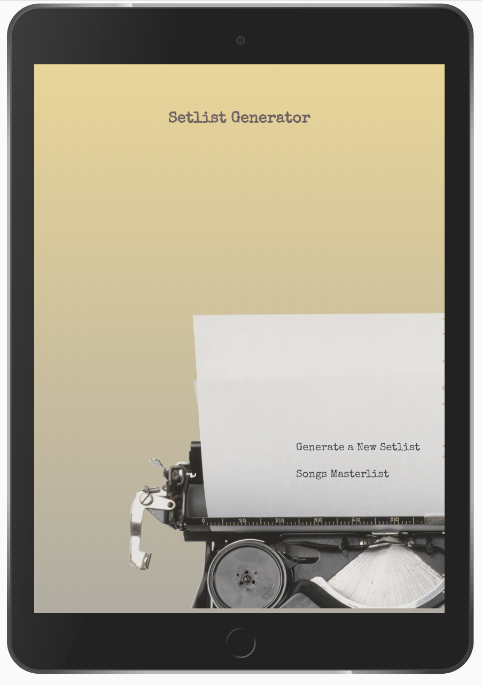
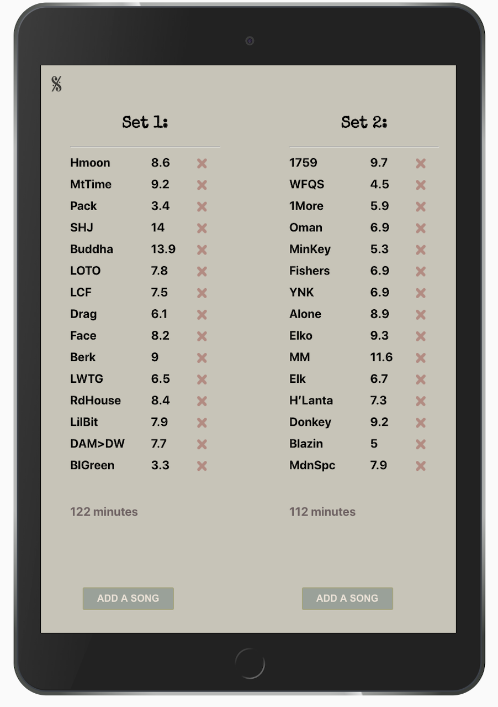
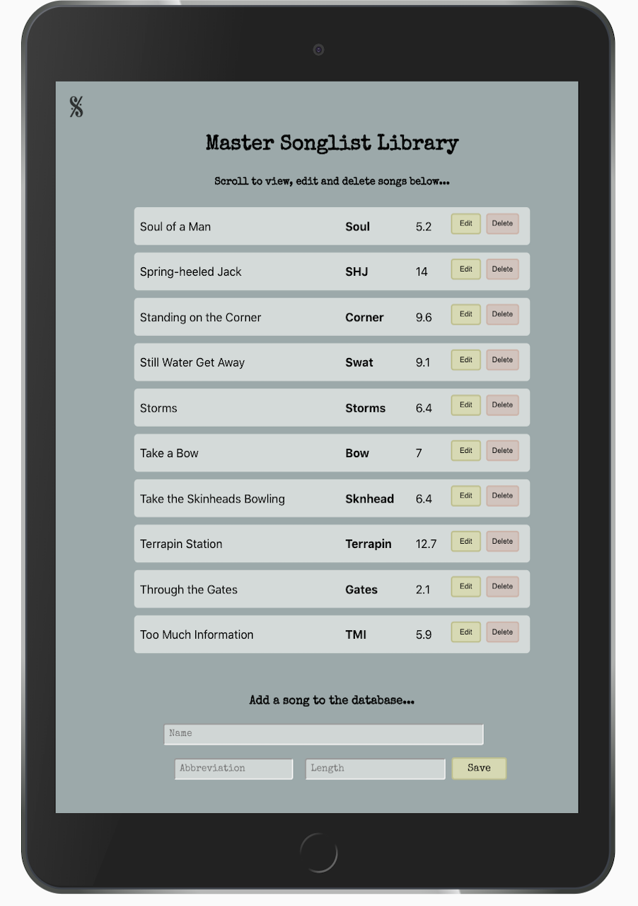

# Setlist Generator 🎵 (v2)

  

https://setlist-generator-v2.vercel.app/

Setlist Generator is an app designed to simplify the touring musician's tedious chore of producing unique, nightly setlists by randomly generating a list of songs from an editable masterlist database. The Setlist Generator will produce a random list and allow the user to eliminate the suggestions that don't work for that set for any reason ranging from musician's personal preference to the demands of a particular geographical location.

Setlist Generator is designed with tablet-first view, as it is a tool to be used at a table optimally in a venue's green room or on a tour bus before a show and not necessarily on the go, since mobile screens do not provide adequate space to view and edit full setlists and desktop views are often impractical for touring musicians. Mobile and desktop views exist but the app has been optimized for tablet.

In its current state the Setlist Generator is set up with a custom database for one specific musical group. It generates lists that display abbreviations of the songs, rather than the entire name of the song (both are listed in the database) because those are the working titles of such songs for list making and printing purposes, as lists would be printed and distributed to bandmembers, periodic guest musicians, light and sound technicians.

## What's New in v2

Version 2 represents a significant architectural upgrade from v1:

### Backend Migration

- **Supabase Integration**: Migrated from Ruby on Rails API backend to Supabase (cloud-hosted PostgreSQL with built-in API)
- **Cloud Database**: Database moved from local PostgreSQL to Supabase cloud hosting
- **Modern API Layer**: Replaced Rails API calls with Supabase client library for more efficient data operations

### Infrastructure Improvements

- **Archive Foundation**: Added complete database schema and backend infrastructure for setlist archiving
- **Scalability**: Cloud-based backend allows for easier deployment and scaling
- **Environment Configuration**: Added proper environment variable management for development and production

### Technical Stack Updates

- Frontend: React with React Router
- Backend: Supabase (PostgreSQL + API)
- Previously: Ruby on Rails API (v1)

### Set Up (v2 - Supabase)

- Fork and clone this repo
- cd into the `setlists/client` directory
- Create a `.env.development` file with your Supabase credentials:
  ```
  REACT_APP_SUPABASE_URL=your_supabase_url
  REACT_APP_SUPABASE_ANON_KEY=your_supabase_anon_key
  ```
- Run `npm install`
- Run `npm start`

### Legacy Setup (v1 - Rails)

If running the Rails backend (legacy):

- cd into the `setlists` directory
- Run `bundle install`
- Run `rails db:create db:migrate db:seed`
- Run `rails s` to initialize the backend server on port 3000
- In a separate terminal, cd into the `client` directory
- Run `npm install` and `npm start` (will run on port 3001)

**Note**: v2 uses Supabase and does not require the Rails server to be running.

Created with [React](https://reactjs.org/) and [Supabase](https://supabase.com/)  
_(Previously built with Ruby on Rails and PostgreSQL in v1)_

http://setlist-generator.surge.sh/

### Current Features

- Users can randomly generate two lists of 15 songs, based on the average of two sets played a night
- Users can delete songs from the generated lists and fetch new random songs to replace them
- Full CRUD operations on the master list of songs - users can add new songs to the database, edit existing songs, and delete them at will
- Automatic calculation of total set time based on song lengths

### Roadmap / Future Enhancements

- **Setlist Archive UI** - Complete the front-end implementation for saving and viewing archived setlists (backend infrastructure is in place)
- **Drag-and-Drop Reordering** - Allow users to rearrange the order of songs in generated setlists
- **Set History** - View past setlists to avoid repetition at venues and consecutive tour dates
- **Filtering** - Filter songs by various criteria (length, style, etc.) when generating lists
- **Print Optimization** - Export formatted setlists for printing and distribution to band members and crew
